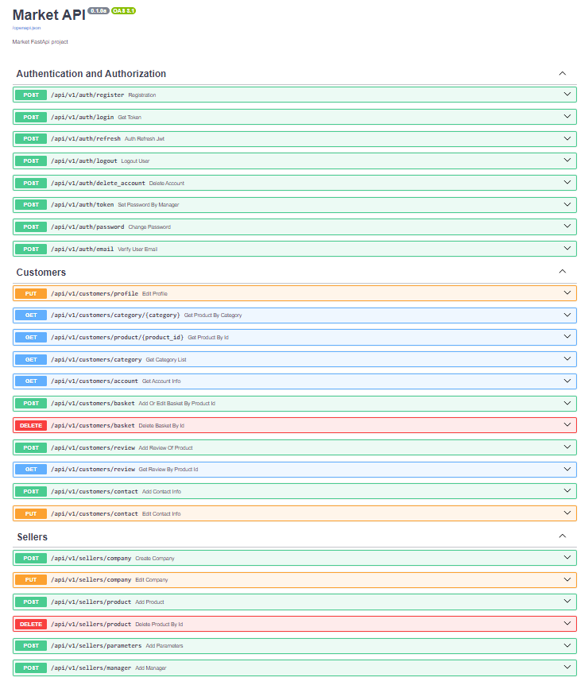
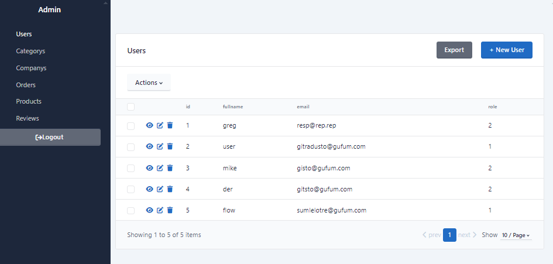
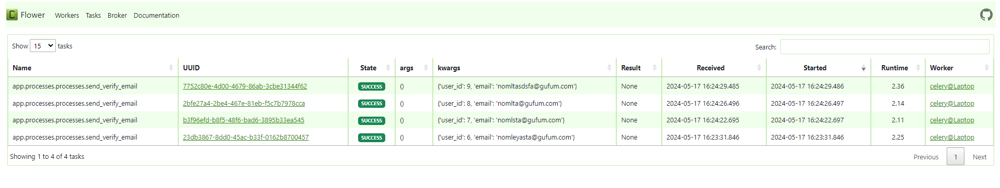

# Market API

Market API, написанный на Fast API, который позволяет регистрироваться покупателям, продавцам. 
Создание компании для продажи товаров, карточки продукта, добавление менеджеров для ведения компании с ограниченными правами.

Реализована отправка писем для подтверждения почты через микросервис задач Celery.

Безопасность конечных точек обеспечена при помощи аутентификации с JWT-токенами (access и refresh), а так же ролевому доступу к операциям.
Создана конечная точка для обновления пары JWT-токенов.

## Используемые технологии
<div> 


</div>

## Содержание
* [Особенности](#особенности)
* [Установка](#установка)
* [Документация](#документация)

## Особенности
* Регистрация и аутентификация пользователей (JWT)
* PostgreSQL в качестве базы данных проекта
* SQLAlchemy Admin для администрирования базы данных
* Миграции базы данных с использованием Alembic
* Celery и Flower для отправки писем на почту
* Использование Docker-контейнеров для удобного развертывания

## Установка

### Системные требования:
<div>


</div>

### Протестировать на своем локальном сервере:
1. Клонируйте репозиторий;
2. Перейдите (`cd`) в клонированный каталог и создайте виртуальное окружение Python (Virtual environment, venv);
3. Активируйте venv и установите pip и все зависимости из `requirements.txt`;
```bash
sudo apt install python3-pip
pip install -r requirements.txt
```
4. Совершите миграцию с помощью Alembic:
```bash
alembic upgrade head
```
5. Скопируйте `.env-example` под именем `.env`, откройте его и заполните переменные;
6. Запустите через командную строку redis: 
```bash
redis-server
```
7. Внутри активированного venv:
```bash
python3 -m app
```

### Запуск проекта на сервере с Docker
1. Переименуйте файл `.env-example` в `.env`, откройте и заполните переменные;
2. Запустите бота: 
```bash
docker compose up -d
```
3. Проверьте, что контейнер поднялся: 
```bash
docker compose ps
```

## Документация

* API (Swagger UI) - http://localhost:8000/docs

## Админ панель

* Админка (SQLAlchemy Admin) - http://localhost:8000/admin

## Flower интерфейс

* Celery (Flower) - http://localhost:9999