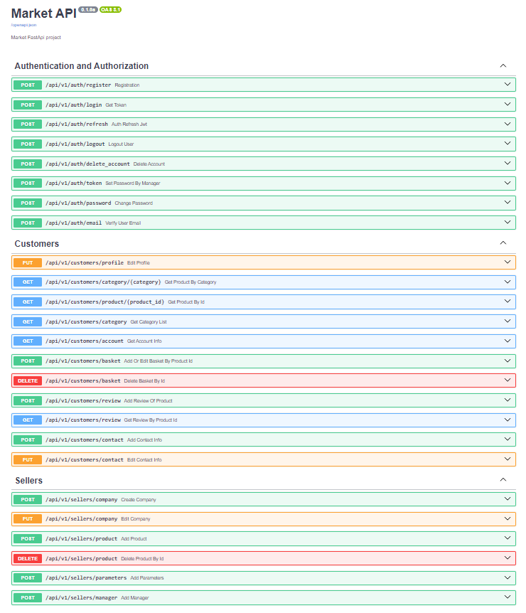
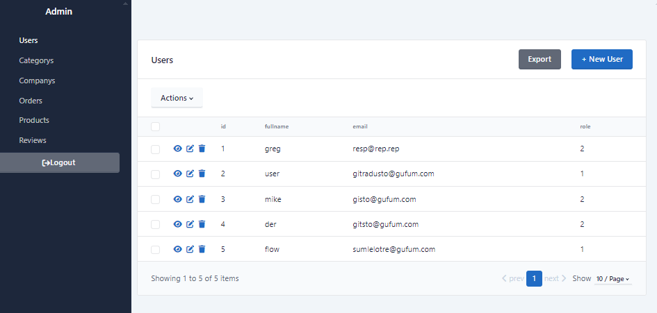

# Market API

[](https://github.com/gmlrep/Market_API/actions/workflows/ci.yml)
[](#testing)
[](https://www.python.org/downloads/)

Market API on FastAPI: registration for customers and sellers, company/product management, JWT auth, Celery email tasks, Redis cache/sessions.

## Features
* JWT authentication (access + refresh) and role-based access
* PostgreSQL + SQLAlchemy 2.0 async + Alembic
* Repository / Service layers with `dependency-injector`
* SQLAdmin, Celery/Flower, Prometheus metrics
* Docker multi-stage image with healthcheck

## Install (local)

1. Clone the repo and `cd` into it
2. Copy `.env-example` to `.env` and fill values
3. Generate JWT keys under `certs/` (`jwt-private.pem` / `jwt-public.pem`)
4. Install with [uv](https://docs.astral.sh/uv/):

```bash
uv sync --group dev
```

5. Run migrations and start:

```bash
uv run alembic upgrade head
uv run python -m app
```

## Docker

```bash
cp .env-example .env
# put JWT PEMs in ./certs
docker compose up --build
```

API: `http://localhost:9000` · Docs: `/docs` · Health: `/health`

## Testing

```bash
uv sync --group dev
uv run coverage run -m pytest tests -v
uv run coverage report -m
```

## Docs

* API (Swagger UI) - http://localhost:8000/docs

## Admin panel

* Admin panel (SQLAlchemy Admin) - http://localhost:8000/admin
